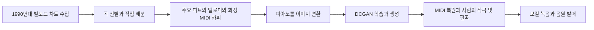
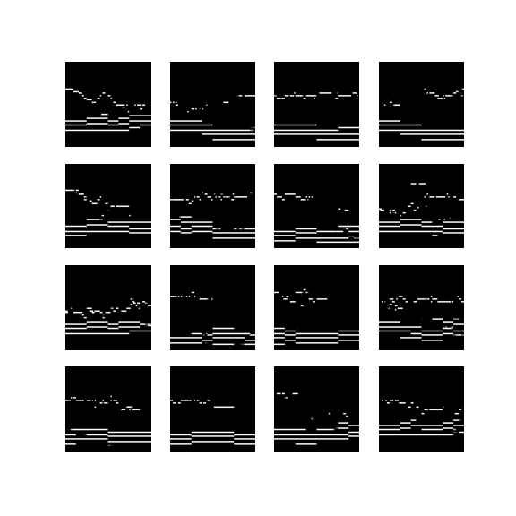

# 22c-990 · AI Music Composition

**1990년대 빌보드 음악을 MIDI와 이미지로 표현하고, DCGAN으로 생성한 음악 소재를 실제 음원 제작과 발매에 연결한 4인 팀 프로젝트입니다.**

신재명(Siberian Onion)이 프로그래밍과 모델 개발을 담당했습니다. 팀원 4명이 학습 자료를 직접 제작하고, 신재명과 이보람(RAMI)이 각각 한 곡의 작곡을 맡았으며, 김동진과 정해완이 보컬로 참여해 더블 싱글을 발매했습니다. 개발과 실행은 Google Colab을 중심으로 진행했습니다.

## 발매 성과

| 항목 | 내용 |
| --- | --- |
| 프로젝트 | 22c-990 |
| 아티스트 | 22세기아이들 |
| 발매일 | 2022년 11월 18일 |
| 수록곡 | New Type · Virtual Girl (But You're) |
| 개발 기록 | 2022년 8월 기획 문서와 Colab 작업 자료 |

[벅스에서 음원과 크레딧 확인](https://music.bugs.co.kr/album/20528080?wl_ref=list_tr_11_ar) · [Apple Music에서 듣기](https://music.apple.com/kr/album/1655058429)

프로젝트명은 **22c-990**을 사용합니다. 연결된 음원 서비스에는 앨범명이 **20c-990**으로 표기되어 있습니다.

공식 크레딧에서 **New Type**의 Music Producer, MIDI Programming, Keys/Bass/Drum, Guitar, Mixed by는 **Siberian Onion**으로, Virtual Girl (But You're)의 Music Producer와 MIDI Programming은 **RAMI**로 표기됩니다. 앨범의 작사·작곡·편곡 크레딧은 팀명 22세기아이들로 기재되어 있습니다. 아래 표는 실제 팀 내 분담을 설명합니다.

## 나의 기여

**신재명 · Siberian Onion · 개발 담당 / 작곡 참여**

- AI 모델과 음악 데이터 처리 프로그래밍을 담당했습니다.
- 빌보드에서 1990년대 곡을 크롤링하고, 선별해서 팀별 카피 작업 목록을 배분하는 코드를 작성했습니다.
- MIDI를 피아노롤 이미지로 변환하고, 팀원이 카피 자료를 확인할 수 있는 Colab 도구를 만들었습니다.
- TensorFlow DCGAN 예제를 음악 이미지에 적용하고, 생성 이미지를 MIDI로 복원하는 흐름을 구현했습니다.
- 팀원들과 MIDI 학습 자료를 제작하고, AI를 활용한 작곡 결과를 「New Type」 제작에 연결했습니다.

| 팀원 | 크레딧명 | 주요 역할 |
| --- | --- | --- |
| 신재명 | Siberian Onion | 프로그래밍·모델 개발, MIDI 자료 제작, 1곡 작곡 |
| 이보람 | RAMI | MIDI 자료 제작, 1곡 작곡 |
| 김동진 | 동진 | MIDI 자료 제작, 보컬 |
| 정해완 | 해완 | MIDI 자료 제작, 보컬 |

## 어떻게 만들었나

팀은 크롤링으로 확보한 차트 정보를 바탕으로 기존 곡의 중요한 파트를 직접 카피했습니다. 박자·조성·길이·벨로시티를 통일한 MIDI로 음악 표현을 정리하고, 멜로디와 화성을 이미지 형태로 학습시켰습니다. 생성된 소재는 사람의 작곡·편곡과 보컬 작업을 거쳐 발매곡으로 완성되었습니다.

모델은 **100차원 잡음 → 64×64 피아노롤 이미지 → 4마디 MIDI**를 생성합니다. 학습 전에는 8마디 MIDI의 음높이 128행 중 사용할 64행을 남기고, 시간축을 절반으로 나눠 이미지 두 개를 만듭니다.

*당시 저장된 생성 이미지 예시입니다. 각 패널은 음높이와 시간으로 표현한 음악 소재이며, 발매곡 악보나 정량 평가 결과를 의미하지 않습니다. [원본 파일과 epoch 표기 설명](docs/technical-notes.md)*

## 코드 살펴보기

| 노트북 | 내용 |
| --- | --- |
| [01 · 차트 선별](notebooks/01_chart_selection.ipynb) | 1990년대 곡 선별과 팀별 작업 목록 생성 |
| [02 · MIDI 검사](notebooks/02_midi_inspection.ipynb) | 팀원이 만든 카피 자료의 피아노롤 확인 |
| [03 · 학습 데이터 제작](notebooks/03_prepare_dataset.ipynb) | 음역 정리와 4마디 분할, 64×64 배열 생성 |
| [04 · DCGAN 학습](notebooks/04_train_dcgan.ipynb) | 생성자·판별자, 적대적 학습과 체크포인트 저장 |
| [05 · MIDI 생성](notebooks/05_generate_midi.ipynb) | 가중치 로드, 이진화, MIDI 저장과 선택적 미리듣기 |
| [원본 실험 기록](notebooks/archive/README.md) | 128 해상도 실험과 배포 v1–v1.2 등 8개 보관본 |

[데이터 제작 규칙](docs/data-preparation.md) · [기술 기록](docs/technical-notes.md) · [자료 출처와 편집 내역](docs/provenance.md)

## Google Colab에서 실행

**[MIDI 생성 노트북 열기](https://colab.research.google.com/github/dev-sjm/22c-990_AI_project/blob/main/notebooks/05_generate_midi.ipynb)**

1. Colab에서 노트북을 엽니다. 01·02는 파일 업로드 방식으로 실행합니다.
2. 데이터부터 시작하려면 03에서 직접 만든 MIDI를 이미지로 변환하고, 04에서 GPU 런타임을 선택해 학습합니다. `RUN_TRAINING=True`로 시작합니다.
3. 학습한 체크포인트가 있으면 05를 바로 실행할 수 있습니다. 같은 번호의 `.index`와 `.data-*` 파일을 준비하고 경로·번호를 맞춥니다. 배포 원본의 기본값은 `ckpt-80`입니다.

03–05의 기본 작업 경로는 `/content/project`입니다. [실행 안내](docs/running.md)와 [검증 기록](docs/validation.md)을 참고하세요. 노트북 출력과 개인 Drive 경로는 제거했으며, 핵심 모델·음악 변환 구현은 보존했습니다.

## 공개 범위와 출처

원곡 카피 MIDI, 학습 배열, 차트 CSV, 모델 체크포인트, 데모 음원, 연락처가 포함된 작업 문서는 제외했습니다. 별도 데이터와 가중치 없이 발매 당시 결과를 재생성할 수는 없습니다. 차트 크롤러는 보관 자료에 포함되어 있지 않습니다.

TensorFlow DCGAN 기반 코드의 출처와 기존 라이선스는 [THIRD_PARTY_NOTICES.md](THIRD_PARTY_NOTICES.md)에 명시했습니다. 프로젝트 고유 코드·문서·음원에 별도 재사용 라이선스는 추가하지 않았습니다.

프로젝트의 성과는 AI 기반 음악 소재 생성부터 실제 발매까지 이어진 제작 경험입니다. 히트 가능성 예측 성능이나 정량적인 생성 품질을 검증했다는 의미는 아닙니다.
